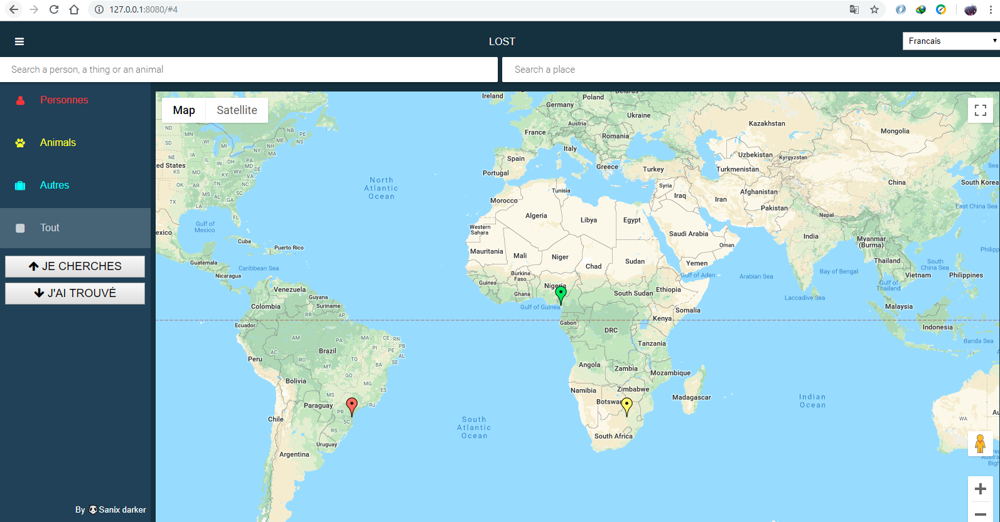
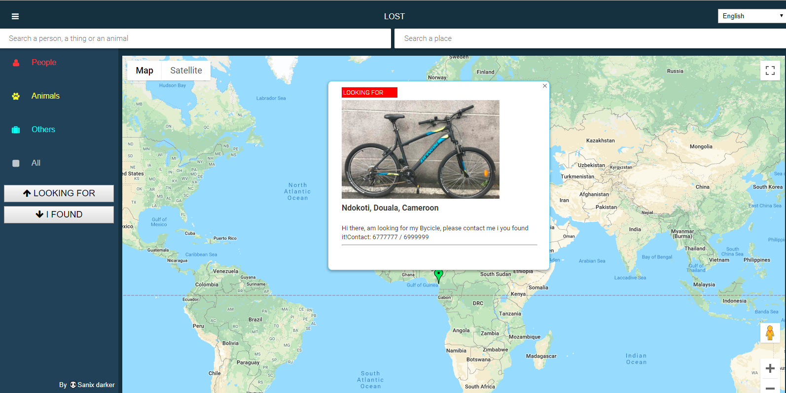
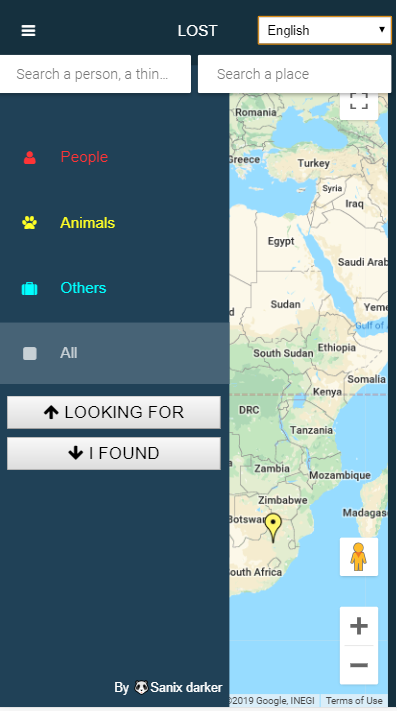
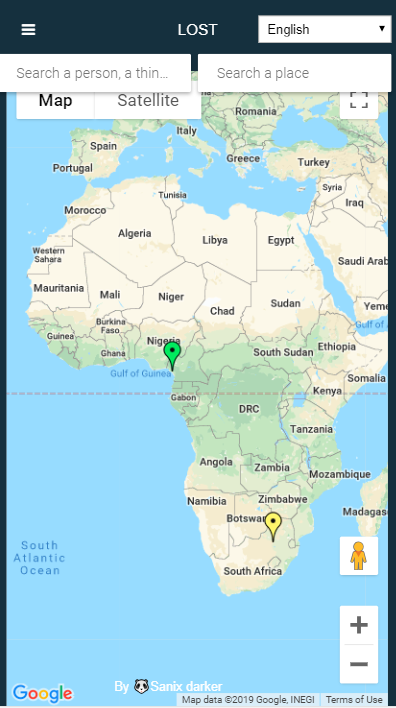
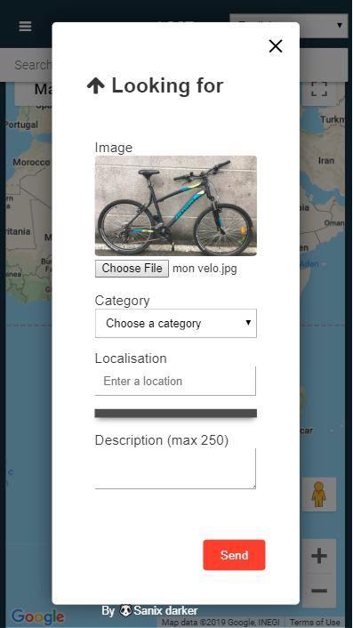

# LOST

## Description

Hi here, this time it's not a developer's tool or a framework or anything else technical in that sense, it's just a simple platform I've created to help people who have lost a loved one, an animal or a particular object in the easiest way possible. That's it that's all.

## Libraries / frameworks used

- *Nothing specialy* (For 97% of the project, i coded from scratch (Any particular lib used)).

## API used

- Externals API used:
    - Google Map
    - Font Awesome Icons

- Lost API used:
    - LostPy (available on /api2) is a python based API i wrote, working with SQLite database
    - LostImg (available on /api3) is a PHP image Based Storage i wrote to same image in another Server.
    - On /api it's also a workable NodeJS API, but i didn't use it.

## What am requesting

As a potential contributor, am asking you to update/add feature on this platform to help people around the Word Finding what they have lost.

## Render

<table>
    <tr>
        <td></td>
        <td></td>
    </tr>
</table>

<table>
    <tr>
        <td></td>
        <td></td>
        <td></td>
    </tr>
</table>

## Author

- [🐼Sanix-darker](https://github.com/sanix-darker).
